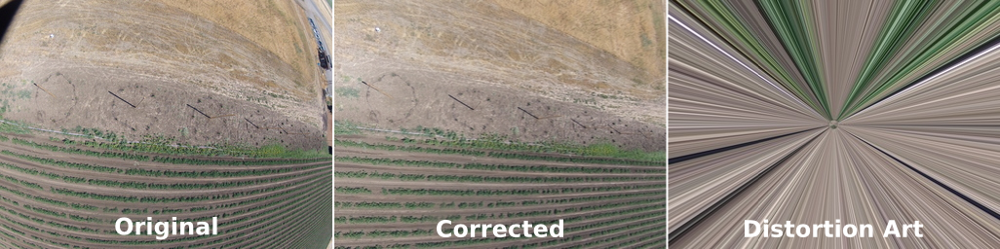

# Lens Correction plugin for GStreamer
#####

A GStreamer plugin written in Python to correct lens distortion using the Lenfun database. 

Should be usable with any camera in the lensfun db.

List of supported cameras and lenses: https://lensfun.github.io/lenslist/

## Requirements

* Python 3 (Tested with 3.13.3)
* OpenCV (Tested with 4.10.0)
* opencv-python (Tested with 4.11.0)
* Lensfun (Tested with 0.3.4)
* lensfunpy (Tested with 1.17.0)
* python3-pi (Tested with 3.50.0-4)
* python3-gst-1.0 (Tested with 1.26.1-1)

Example

## Usage

1. Install the prequisites
```
#Debian Trixie
sudo apt-get install gstreamer1.0-plugins-base gstreamer1.0-opencv gstreamer1.0-python3-plugin-loader gstreamer1.0-tools libpython3-dev python3-opencv python3-gi python3-gst-1.0 python3-lensfun
git clone https://github.com/nuess0r/lenscorrection-gst.git
rm ~/.cache/gstreamer-1.0/registry.x86_64.bin
```
1. Open a terminal in the directory 'lenscorrection-gst'
1. Add the local directory to the GStreamer plugin path
```
file lenscorrection-gst.py
export GST_PLUGIN_PATH=$(realpath .)
```
1. Test if GStreamer sees the plugin with gst-inspect
```
PAGER=cat gst-inspect-1.0  sample_filter
```
1. Test the plugin
```
python3 python/test.py
```
1. Test the plugin within a full GStreamer pipeline using gst-launch
```
gst-launch-1.0  v4l2src device=/dev/video0 ! 'video/x-raw, width=640, height=480, framerate=30/1' ! videoconvert ! 'video/x-raw, width=640, height=480, framerate=30/1' ! lenscorrection aperture=5.6 focallength=35 distance=2.0 ! 'video/x-raw, width=640, height=480, framerate=30/1' ! tee name=t ! queue ! videoconvert !  x264enc tune=zerolatency bitrate=2000 speed-preset=ultrafast ! flvmux streamable=true ! fakesink t. ! queue ! videoconvert ! xvimagesink handle-events=false
```

## Notes

Setting camera manufactuer, camera type and lens type is broken

## References

This plugin is based on the tutorial from fluendo: https://fluendo.com/blog/opencv-to-gstreamer-cs-service/

And the tutorial from Jason Kim:
https://medium.com/@jasonlife/writing-gstreamer-plugin-with-python-b98627cd24c1

Using lensfunpy and openCV for lens correction of images was already implemented by wildintellect in https://github.com/wildintellect/lenscorrection

